# bomblab 实验报告

首先使用 `objdump –d bomb > bomb.s` 从 object code 得到 assmebly code。

> `gdb` 调试常用的指令有：
>
> - `unix> gdb bomb` 运行 gdb 调试 bomb
> - `(gdb) run result.txt` 以参数 result.txt 调试 bomb
> - `break *0x40133f` 在 0x40133f 处设置断点
> - `print /d $rsi` 以十进制输出寄存器 rsi 的值
> - `print (char *) 0xbfff890` 输出以 0xbfff890 为首地址的字符串
> - `x/64xb 0x402440` 打印从 0x402440 开始的 64 个字节

## phase_1

phase_1 函数汇编代码:


根据 strings_not_equals 函数可知，这是一个判断两个字符串是否相同的函数。从 bomb.c 中可知：

```c
input = read_line();
phase_1(input);
```

第一个参数 %rdi 是我们输入的字符串，这里它又将 \$0x4023d0 传到第二个参数寄存器 %esi 中，把它们作为参数传给 strings_not_equals 函数，因此可以得知，0x4023d0 开头的字符串就是我们要传的字符串。

使用 `pring (char *) 0x4023d0` 得到 `Slave, thou hast slain me. Villain, take my purse.` 即 phase_1 的答案。


## phase_2

phase_2 函数汇编代码:


phase_2 还引用了一个 read_six_numbers 函数，其参数为我们的 input 和 %rsi，此时为 %rsi 为 %rsp，并且 %rsp 在最开始减少 32 字节 `sub $0x20 %rsp`，因此可以猜测可能要将参数存储在栈帧上。

read_six_numbers 函数汇编代码：


注意到 read_six_numbers 调用了 c 语言的 sscanf 函数，sscanf 第一个参数为 input(%rdi)，第二个参数为 \$0x4025c3(%esi)，gdb 查看以 0x4025c3 开头的字符串：

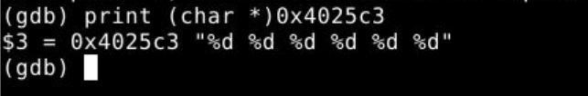

得知其为 `%d %d %d %d %d %d`，作为 sscanf 函数的第二个参数，可知这里的意思是将我们的 input 按照 `%d %d %d %d %d %d` 的格式写到一些局部变量里，phase_2 需要我们输入 6 个整数，它们被写到了栈上。因此 %rsp 到 %rsp + 0x18 就是我们输入的 6 个整数。

回到 phase_2，如果第一个输入小于 0，则直接爆炸：

```assembly
# explode if the first input number is less than 0
400ea8:	83 3c 24 00          	cmpl   $0x0,(%rsp)
400eac:	78 07                	js     400eb5 <phase_2+0x2a>
```

phase_2 的核心代码，本质是一个 for 循环：

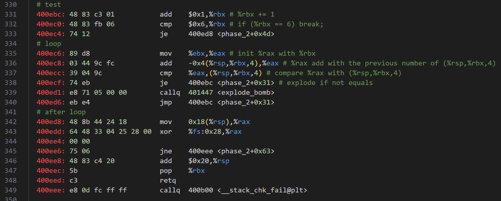

loop 循环体中，先把 %rax 赋值为 %rbx，然后让 %rax 加上 `0x4(%rsp,%rbx,4)`。

> 给我们输入的 6 个整数分别标号 0 1 2 3 4 5
>
> 那么 `(%rsp,%rbx,4)` 指的就是第 %rbx 个整数，`0x4(%rsp,%rbx,4)` 是第 %rbx - 1 个整数

最后判断如果 %rax 和 `(%rsp,%rbx,4)` 不相等就爆炸。

于是得到我们的输入应该满足：

1. 6 个整数，以空格分开；
2. 头一个整数大于 0；
3. 从第 i = 1 个整数开始，满足 input[i] = input[i - 1] + i；

给出一个合理的输入即可，比如：`1 2 4 7 11 16`

验证后证明结果正确：

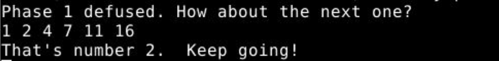


## phase_3

phase_3：

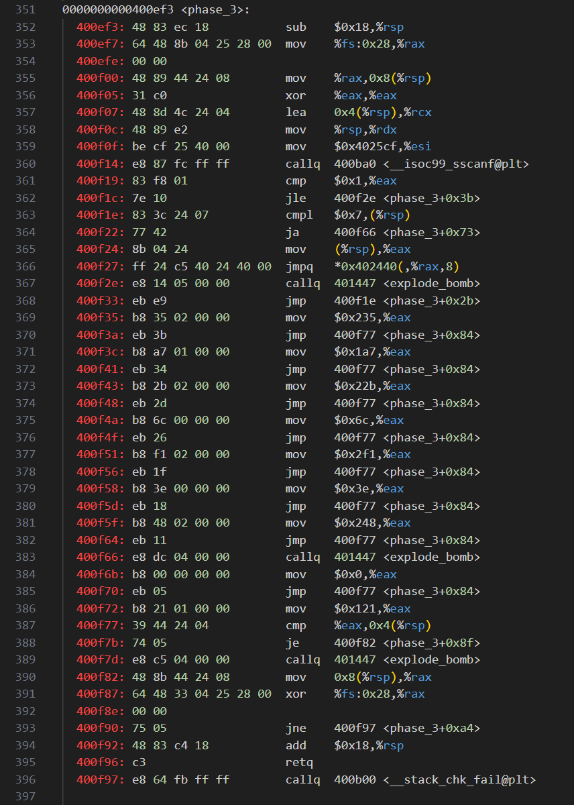

可以看到 phase_3 一开始调用了 sscanf 函数处理我们的 input，直接老样子，先看一下第二个参数，也就是输入的格式是什么：


看来我们需要输入两个整数，它们存储在栈上面。

phase_3 的核心代码中，很明显用到了跳转表，是一个 switch 语句：

```assembly
# explode if the first input number is greater than 7 or less than 0
400f1e:	83 3c 24 07          	cmpl   $0x7,(%rsp) 
400f22:	77 42                	ja     400f66 <phase_3+0x73>

400f24:	8b 04 24             	mov    (%rsp),%eax
400f27:	ff 24 c5 40 24 40 00 	jmpq   *0x402440(,%rax,8)
```

从中可得：

1. 如果第一个参数大于 7 或者小于 0，则爆炸。得知 case 的范围是 0~7，一共 8 个数。
2. switch 的数据类型为 long，`switch(第一个参数)`。

看一眼跳转表 0x402440，使用命令 `x/xb64 0x402440`，意为查看从 0x402440 开始的 64 个字节，因为一个地址占 8 个字节，case 一共 8 个，所以长度为 64 个字节：


一共 8 行，每一行正好代表一个地址，从上到下依次是 first_input = 0 1 2 … 7 的时候，跳转到的地址。但是读的时候一定要注意存储的方式是小端法，因此地址的低字节存储在低地址，拿第一行为例，0x72 应该是地址的最低字节，因此读的时候“从右向左”读，得到 case 0 时，跳转到 `0x400f72`。

同理可以得到所有 case 跳转的地址，我把它们标记到下图中：

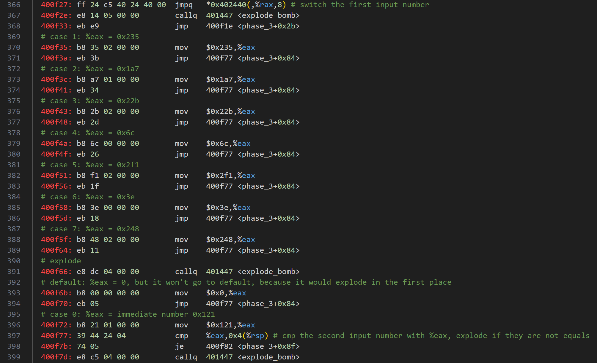

最后所有 case 都会 `cmp   %eax,0x4(%rsp)`，即判断第二个输入和经过赋值后 %eax 是否相等。

于是可以得到我们输入要求：

1. 两个整数
2. 第一个整数为 0~7；
3. 第二个整数为：相应 case 中给 %eax 赋值的立即数。

因此 phase_3 有 8 个合理的输入：

1. `0 289`
2. `1 565`
3. `2 423`
4. `3 555`
5. `4 108`
6. `5 753`
7. `6 62`
8. `7 584`

随便选一个，成功通过：


## phase_4

phase_4：

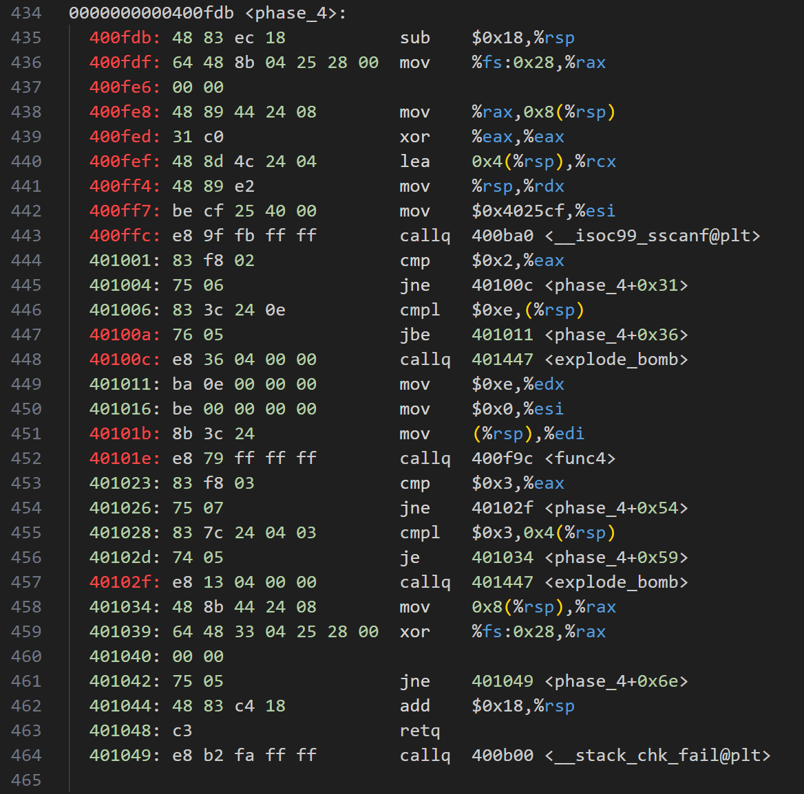

老规矩，看一下 sscanf 的 format：

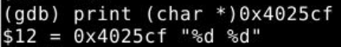

输入是两个整数。

先简单分析一下，结果如下：

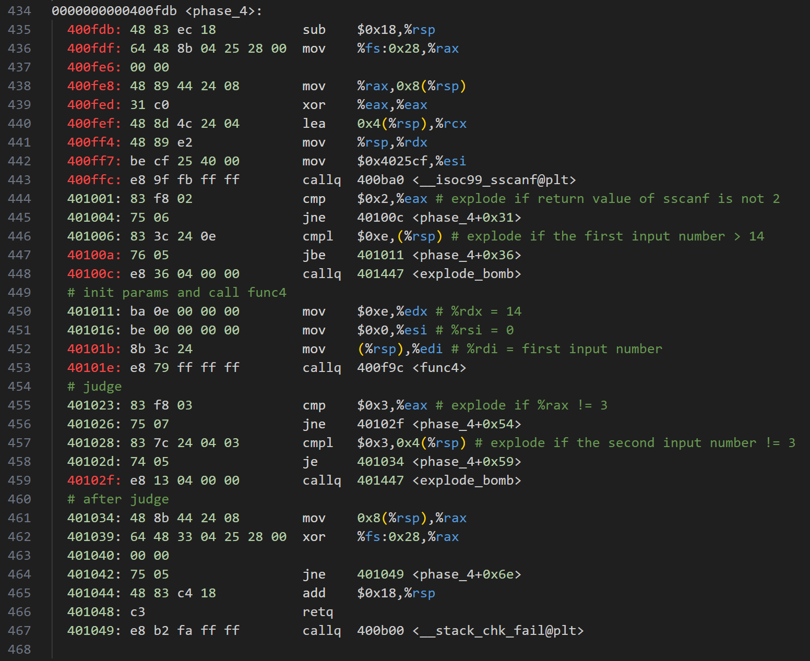

显然第二个整数必须是 3，我们重点分析 func4：

传入的参数：`%rdi = first input number`，`%rsi = 0`，`%rdx = 14`，以及我们存储在 %rsp 中的两个输入整数。

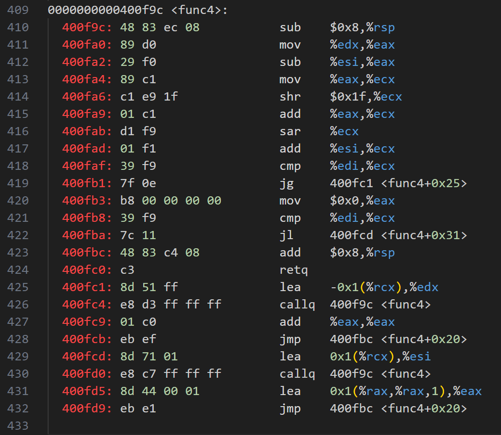

分析后如图：

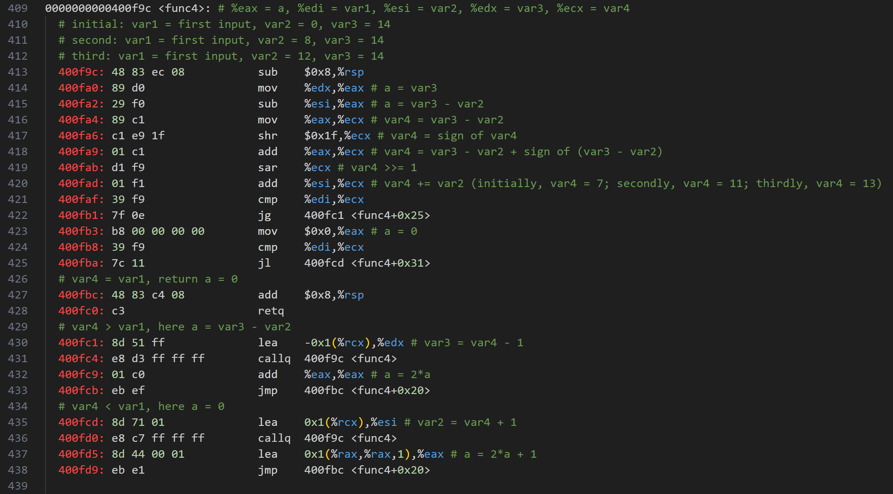

我们知道最后 a 必须是 3 才能成功。

第一次递归的返回值 a 必须等于 3 ，只有 a = a \* 2 + 1 才能得到 3，因此第一次必须满足 `var4 < var1`，即输入必须 > 7。

第二次递归的返回值 a 必须为 1，因此第二次递归中也必须满足 `var4 < var1`，即输入 > 11。

第三次递归的返回值 a 需要为 0，这里有两种可能：

1.  `var4 = var1` 直接 return a = 0，var1 = 13，我们的第一个输入是 13。因此第一个答案是 `13 3`

	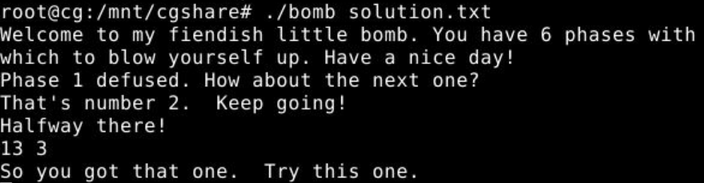

2. `var4 > var1`，输入满足 `11 < input < 13`，只能是 12。但是仍然要检验这种可能是否合理！第四次递归的返回值是 0，运算结束后的 var4 = 12，刚好和 input 相等，然后返回 a = 0，与我们的推理一致，因此第二个答案是 `12 3`

	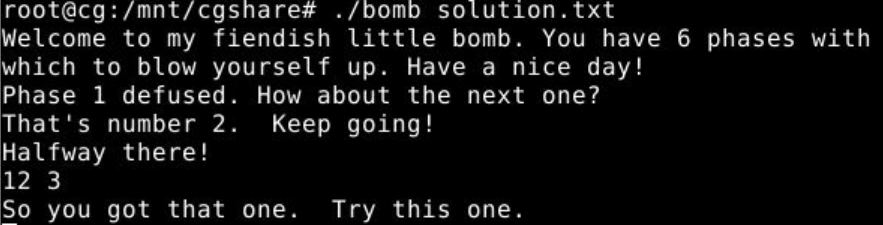


## phase_5

phase_5：

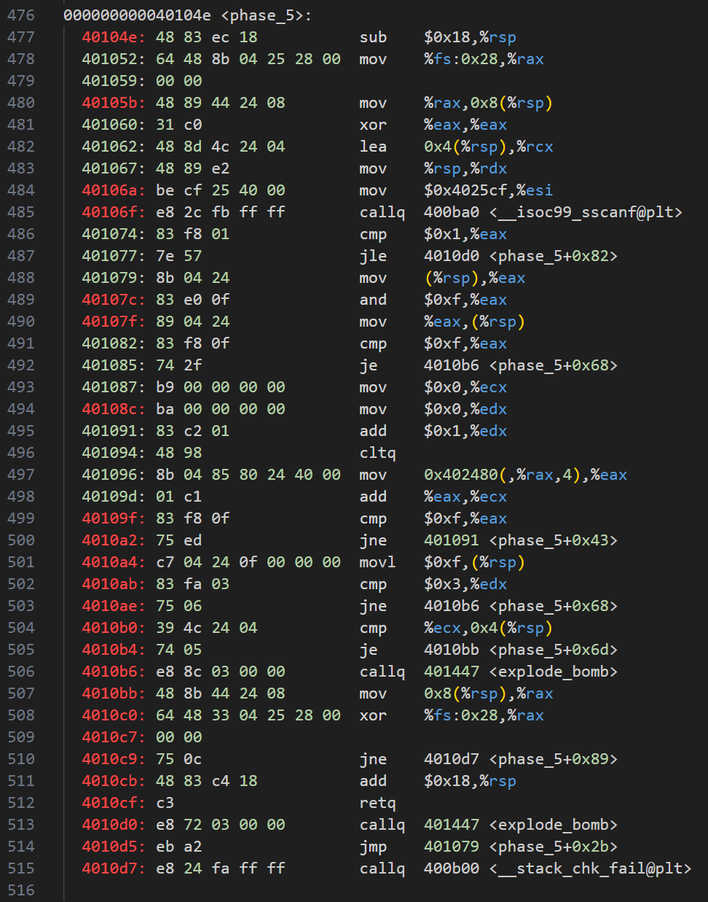

0x4025cf 是不是有点印象，这跟 phase_4 里面的 format 字符串放在同一个地址。由此还能得知：c 语言将所有的字符串放到一片内存里面，相同的字符串只会分配一个地址，这样可以节省内存开销。

简单分析后如下图：

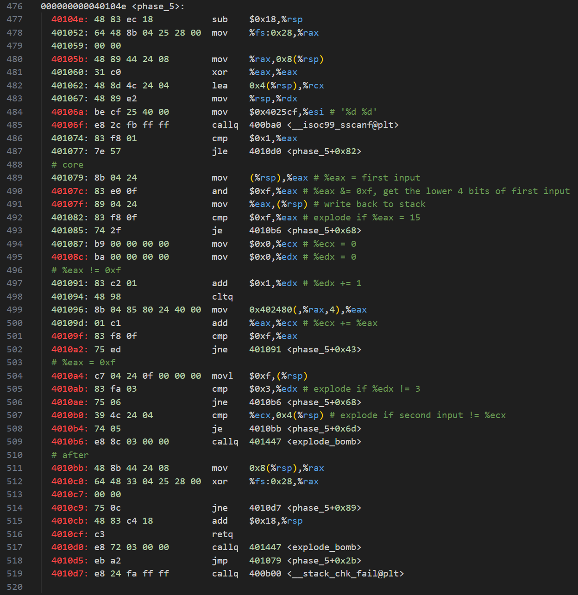

最核心的部分就是 `mov   0x402480(,%rax,4),%eax` 后 %eax 的值。我们先用 gdb 来看一下 0x402480 开头的这个 int 数组，由于上面 %eax &= 0xf，因此数组的索引范围是 0~15，一个 int 4 字节，4 \* 16 = 64 个字节：

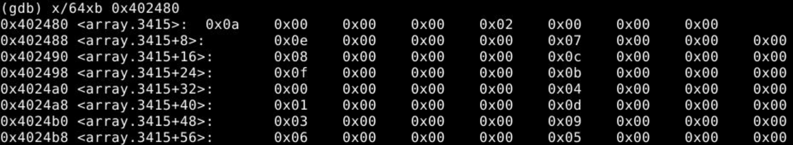

根据小端法取出这 15 个整数：`[10, 2, 14, 7, 8, 12, 15, 11, 0, 4, 1, 13, 3, 9, 6, 5]`，发现它们刚好是不重复的 0~15。

走到 `%eax = 0xf` 代码段中时，要求 `%edx == 3`，而 %edx 最初等于 0，因此需要执行 3 次 `%eax != 0xf` 的代码之后，`%eax = 0xf`。

这下就简单了，只需要倒推。第三次之后 %eax = 15，那么第二次之后 %eax = 6，第一次之后 %eax = 14，最开始 %eax = 2，所以第一个输入 & 15 = 2，比如 0x7ffffff2 = 2147483634

%ecx 等于 0 + 14 + 6 + 15 = 35，所以第二个输入为 35。

轻松通过验证：

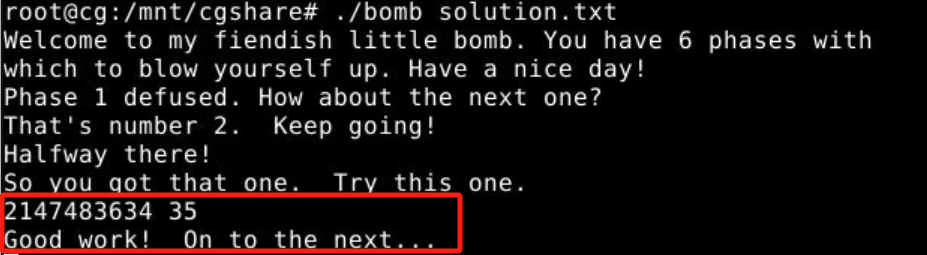


## phase_6

代码太多了，就不贴出来了…

首先调用 read_six_numbers，可知需要输入 6 个整数。

由于汇编代码过长，因此相较于直接阅读汇编代码，不如根据汇编代码，写出伪代码以便阅读：

1. 读取输入的 6 个整数，存储到栈上：

	```c
	call <read_six_numbers> // 读取输入的 6 个整数
	r12 = rsp
	r13 = rsp // r12、r13 指向第一个数的地址
	r14d = 0x0 // r14d 初始化为 0，以便后续计数
	```

2. 校验输入参数，每个数不能大于 6，且 6 个数互不相同：

	```c
	loop1:
	rbp = r13;
	eax = *r13; // eax 为当前 *r13 处取一个整数
	eax -= 0x1;
	if(eax > 0x5) { // 校验每个输入的数不能 > 6(之前eax-1了)
	    call <explode_bomb>;
	}
	r14d += 0x1
	if (r14d != 0x6) { // 检验6个数互不相同
	    ebx = r14d; // ebx 初值为当前的 index
	    while (1) { // 
	        rax = ebx;
	        eax = *(rsp + 4 * rax); // 取出 index 后面的一个数
	        if (*rbp != eax) { // 如果当前 index 的数，和 index 后面的一个数不相同
	            ebx += 0x1; // 继续向后遍历
	            if (ebx > 0x5) { // 直到遍历完当前 index 后面的所有数
	                r13 += 0x4; // 继续校验下一个 index 是否和下一个 index 后面的数相同
	                goto loop1; // r14d++，继续遍历下一个 index 的数
	                break;
	           }
	       }
	        else {
	            call <explode_bomb>;
	       }
	   }
	}
	```

3. 完成校验后进入核心代码：

	```c
	if (r14d == 0x6) { // 校验完所有的输入数后
	    
	    rcx = r12 + 0x18; // 栈顶向上 24 位
	    edx = 0x7; 
	    do {
	        eax = edx; // 把 eax 置为 7
	        eax -= *r12; // 7 减去当前 r12 取一个整数
	        *(r12) = eax; // 写入 stack
	        r12 += 0x4; // 遍历下一个数
	   	} while (rcx != r12); // 把所有数转化成 7-x
	    
	    esi = 0x0; // 用于遍历计数，类似于 index
	    while (1) { // 无限循环，直到找到特定条件
	        ecx = *(rsp + 4 * rsi); // 从栈中取出当前的输入数
	        eax = 0x1;
	        edx = 0x6032d0; // 链表“数组”的首地址
	        if (ecx > 0x1) {
	            do {
	                rdx = *(rdx + 0x8); // 移动到链表的下一个节点
	                eax += 0x1;
	            } while (ecx != eax); // 重复直到 ecx 和 eax 相等
	        }
	        *(rsp + 8 * rsi + 0x20) = rdx; // 将第 input number 个节点的首地址存储到栈中，偏移量是 0x20
	        rsi += 0x1; // 增加计数器
	        if (rsi == 0x6) { // 遍历完所有输入的数之后：
	            rbx = *(rsp + 0x20); // 偏移后的第一个节点，即第 input[0] 个节点
	            rax = *(rsp + 0x28); // 第 input[1] 个节点
	            *(rbx + 0x8) = rax; // 第 input[0] 节点.next = 第 input[1] 节点
	            rdx = *(rsp + 0x30); // 第 input[2] 个节点
	            *(rax + 0x8) = rdx; // 第 input[1] 节点.next = 第 input[2] 节点
	            rax = *(rsp + 0x38); // 第 input[3] 个节点
	            *(rdx + 0x8) = rax; // 第 input[2] 节点.next = 第 input[4] 节点
	            rdx = *(rsp + 0x40); // 第 input[4] 个节点
	            *(rax + 0x8) = rdx; // 第 input[3] 节点.next = 第 input[4] 节点
	            rax = *(rsp + 0x48); // 第 input[5] 个节点
	            *(rdx + 0x8) = rax; // 第 input[4] 节点.next = 第 input[5] 节点
	            *(rax + 0x8) = 0x0; // 第 input[5] 节点.next = null
	            ebp = 0x5; // 设置 ebp 为 5，可能用于计数
	            loop2:
	            rax = *(rbx + 0x8); // 第 input[0] 个节点.next
	            eax = *(rax); // 第 input[0] 个节点.next.val
	            if (*rbx >= eax) { // 前一个节点.val >= 其.next.val
	                rbx = *(rbx + 0x8); // rbx 移动到下一个节点
	                ebp -= 0x1; // 减少 ebp 的值
	                if (ebp == 0x0) {
	                    retq;
	                } else { // 如果 ebp 不为 0
	                    goto loop2; // 跳转到 loop2 继续循环
	                }
	            } else { // 如果 rbx 的值小于 eax 的值
	                call <explode_bomb>; // 调用 explode_bomb 函数，可能是某种错误处理
	            }
	        }
	    }
	}
	```

4. 看一眼链表“数组”的首地址 0x6032d0 后面的链表结构：

	

	可以看到每个 node 占 16 字节，包括两个 int 和一个 next 指针，两个 int 分别是 val 和 num。

	每一个节点的 val 分别为 `[0x27a, 0x353, 0x399, 0x136, 0x249, 0x08a]`

5. 核心代码的逻辑就是先把输入的 6 个数映射为 7 - x；然后重组链表，重组的 node 顺序就是映射为 7 - x 后的数组顺序；最后进行校验，要求重组后的链表节点 val 递减。

6. 这下简单了，各节点的 val 顺序由大到小排序是 `3 2 1 5 4 6`，这是 7 - x 映射后的顺序，那么我们输入的就是 `4 5 6 2 3 1`。

7. 成功完成 bomblab：

	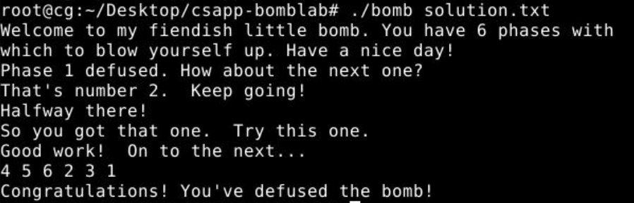


## secret_phase

找到 secret_phase 之后，首先要找出怎么样才能触发 secret_phase，经过查找发现只有 phase_defused 函数中调用了 secret_phase。

phase_defused：

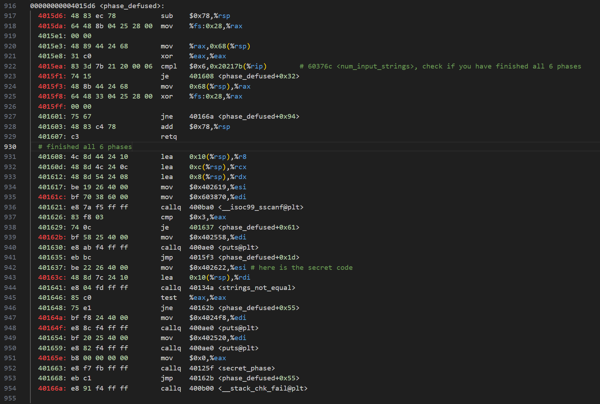

可以看到首先会检查你是不是全部阶段都完成了。完成后的代码中有一个 strings_not_equals 函数的调用，根据 phase_1 的经验，这肯定是在校验我们的密钥了，往上几行可以看到 `mov   $0x402622,%esi` 给 strings_not_equals 函数赋值第二个参数，那么显然 0x402622 就是密钥的首地址了，让我康康：

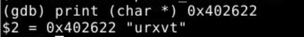

OK，拿到密钥 `urxvt`，按照实验文档的提示在 phase_4 的解后加上后，再次运行：


好！密钥正确，但是还需要解开 secret_phase 的输入…

简单分析 secret_phase 的代码：

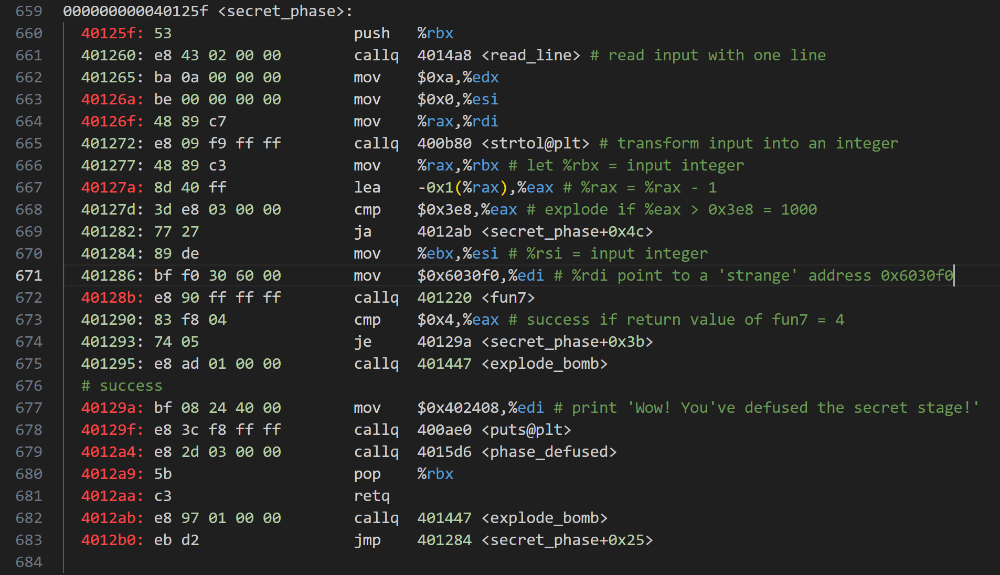

可以看到我们输入的一行会被强制转为一个整数，因此我们的输入就应该是一个整数。

这个整数 - 1 <= 1000，且 > 0（否则 ja 转为 unsigned 时肯定比 1000 大），得到我们输入的整数范围是 `0 < input <= 1001`。

secret_phase 调用了一个函数 fun7，最后如果 fun7 的返回值是 4，则成功。

secret_phase 给 fun7 传递的参数有两个，我们的输入，和一个神秘的地址。

我们来看一下这个 0x6030f0 究竟是什么，经过尝试后查看其后 512 字节：

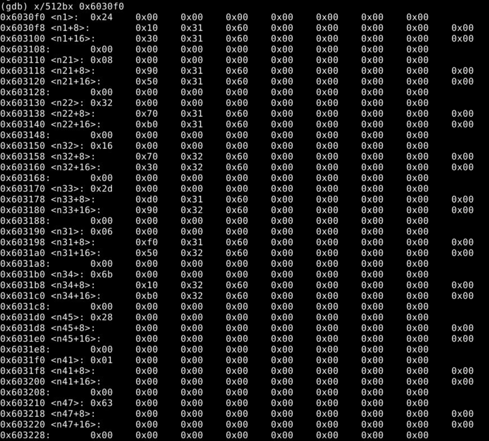

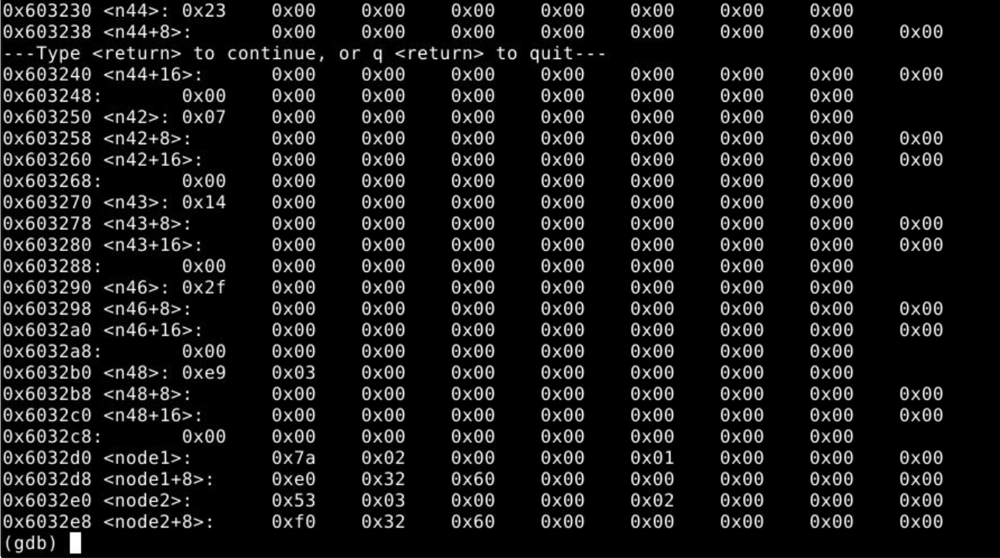

可以看到 0x6030f0 后是一系列名为 "n" 的结构体，每一个结构体的大小是 24 字节。阅读第一个结构体对象 n1，其第一行存储的是 0x24；第二行存储的是 0x603110，这正好是 n21 的首地址；第三行存储的是 0x603130，这正好是 n22 的首地址。由此可以推断出，这个 n 结构体可能是一个二叉树的节点，其结构类似于：

```c
typedef struct {
    int val; // 为了对其，因此 int "占了" 8 个字节
    n* left;
    n* right;
} n;
```

n1 只有一个，n2 开头有 2 个，n3 开头有 4 个，n4 开头有 8 个，这进一步验证我们的猜想。因此 fun7 的第二个参数是一棵二叉树根节点的指针！

fun7 的参数如下：

```c
int fun7(n* root/* %rdi */, int input/* %rsi */) {...}
```

我们再来分析 fun7 的代码：

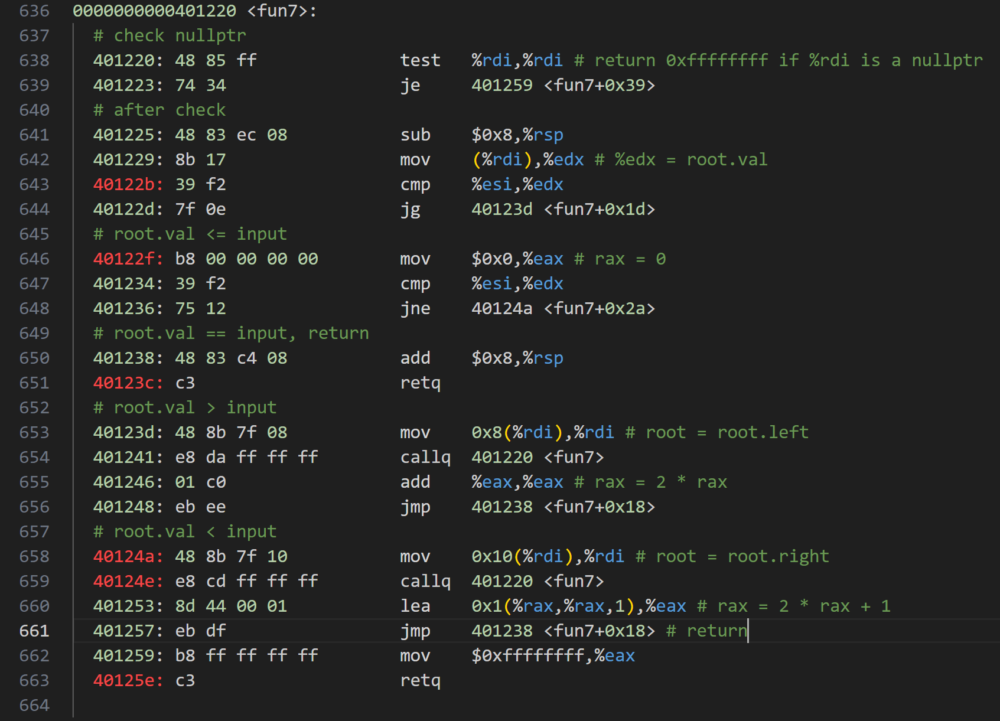

知道传入的参数是二叉树根节点后，一切都变得简单起来。这不就是在二叉搜索树中查找 val = input 的节点吗，甚至可以写出其 c 代码：

```c
int fun7(n* root, int input) {
    if (root == nullptr) {
        return 0xffffffff;
    }
    int rax;
    if (root->val > input) {
        rax = fun7(root->left, input);
        rax = 2 * rax;
    } else {
        rax = 0;
        if (root->val < input) {
            rax = fun7(root->right, input);
            rax = 2 * rax + 1;
        }
    }
    return rax;
}
```

我们需要最后 fun7 返回 4，一种可以到达 4 的方式是：0 -> 1 -> 2 -> 4，分别对应的判断是 input == val, input > val, input < val, input < val，我们正常的顺序是反过来的，因此我们的输入应该走过的路径是 left, left, right, 命中。

> 由于给出的二叉树只有 4 层，因此必须在 4 步之内让 0 变为 4，上述的 `0 -> 1 -> 2 -> 4`，是唯一的可行方案，因此本题的解唯一。

观察我们上面用 gdb 打印的二叉树节点图，从根节点开始进行 `left, left, right` 的操作，n1 -> n21 -> n31 -> n42，n42.val = 7，因此本题的唯一解是 7。

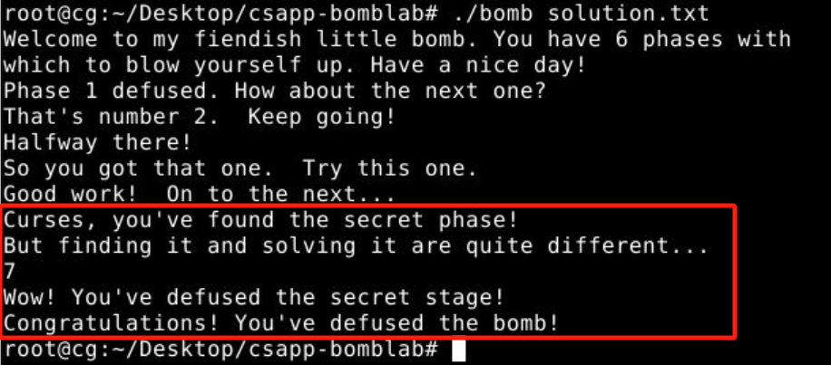

成功，自此 bomblab 完全完成！

> solution.txt: 
>
> ```c
> Slave, thou hast slain me. Villain, take my purse.
> 1 2 4 7 11 16
> 6 62
> 12 3 urxvt
> 2147483634 35
> 4 5 6 2 3 1
> 7
> ```


