# bomblab 实验报告

首先使用 `objdump –d bomb > bomb.s` 从 object code 得到 assmebly code。

> `gdb` 调试常用的指令有：
>
> - `unix> gdb bomb` 运行 gdb 调试 bomb
> - `(gdb) run result.txt` 以参数 result.txt 调试 bomb
> - `break *0x40133f` 在 0x40133f 处设置断点
> - `print /d $rsi` 以十进制输出寄存器 rsi 的值
> - `print (char *) 0xbfff890` 输出以 0xbfff890 为首地址的字符串
> - `x/64xb 0x402440` 打印从 0x402440 开始的 64 个字节

## phase_1

phase_1 函数汇编代码:

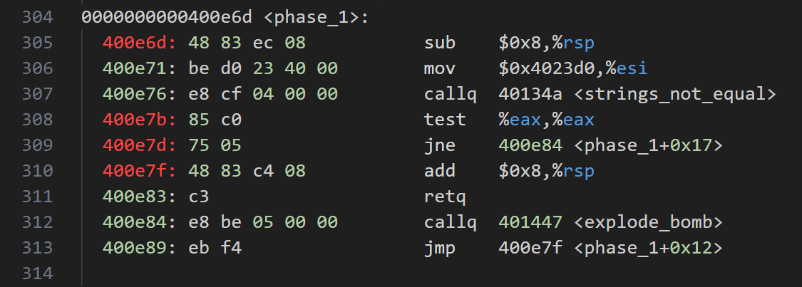

根据 strings_not_equals 函数可知，这是一个判断两个字符串是否相同的函数。从 bomb.c 中可知：

```c
input = read_line();
phase_1(input);
```

第一个参数 %rdi 是我们输入的字符串，这里它又将 \$0x4023d0 传到第二个参数寄存器 %esi 中，把它们作为参数传给 strings_not_equals 函数，因此可以得知，0x4023d0 开头的字符串就是我们要传的字符串。

使用 `pring (char *) 0x4023d0` 得到 `Slave, thou hast slain me. Villain, take my purse.` 即 phase_1 的答案。

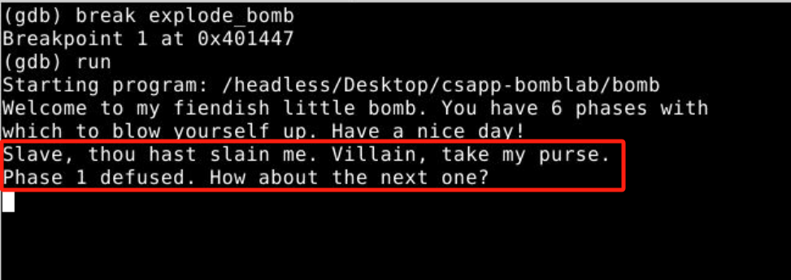


## phase_2

phase_2 函数汇编代码:

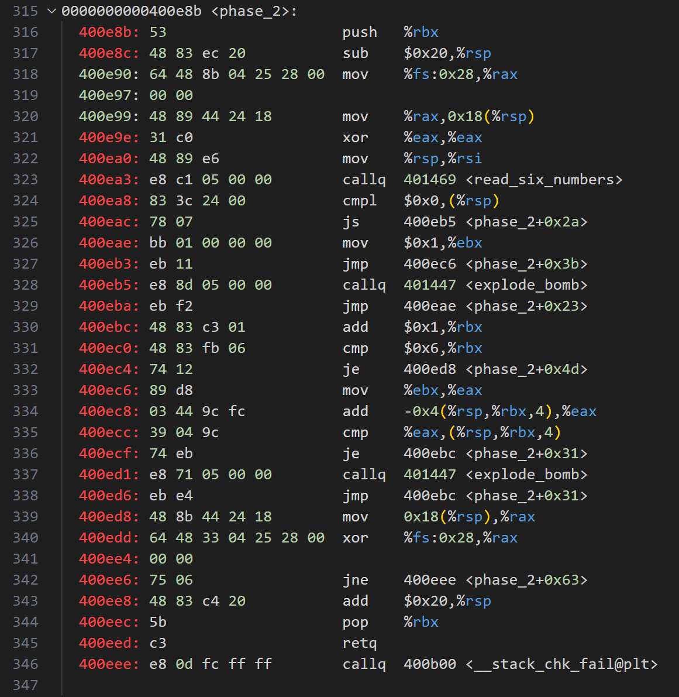

phase_2 还引用了一个 read_six_numbers 函数，其参数为我们的 input 和 %rsi，此时为 %rsi 为 %rsp，并且 %rsp 在最开始减少 32 字节 `sub $0x20 %rsp`，因此可以猜测可能要将参数存储在栈帧上。

read_six_numbers 函数汇编代码：

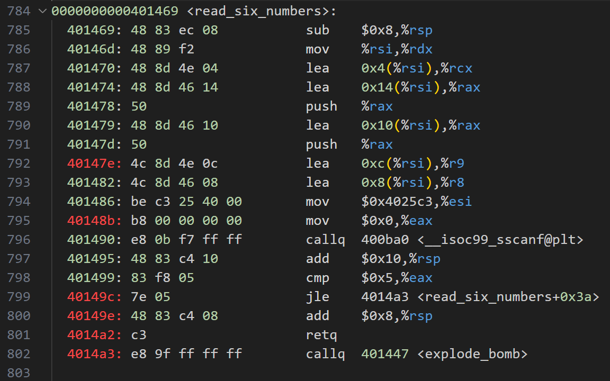

注意到 read_six_numbers 调用了 c 语言的 sscanf 函数，sscanf 第一个参数为 input(%rdi)，第二个参数为 \$0x4025c3(%esi)，gdb 查看以 0x4025c3 开头的字符串：

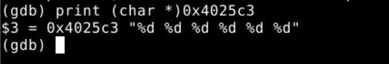

得知其为 `%d %d %d %d %d %d`，作为 sscanf 函数的第二个参数，可知这里的意思是将我们的 input 按照 `%d %d %d %d %d %d` 的格式写到一些局部变量里，phase_2 需要我们输入 6 个整数，它们被写到了栈上。因此 %rsp 到 %rsp + 0x18 就是我们输入的 6 个整数。

回到 phase_2，如果第一个输入小于 0，则直接爆炸：

```assembly
# explode if the first input number is less than 0
400ea8:	83 3c 24 00          	cmpl   $0x0,(%rsp)
400eac:	78 07                	js     400eb5 <phase_2+0x2a>
```

phase_2 的核心代码，本质是一个 for 循环：


loop 循环体中，先把 %rax 赋值为 %rbx，然后让 %rax 加上 `0x4(%rsp,%rbx,4)`。

> 给我们输入的 6 个整数分别标号 0 1 2 3 4 5
>
> 那么 `(%rsp,%rbx,4)` 指的就是第 %rbx 个整数，`0x4(%rsp,%rbx,4)` 是第 %rbx - 1 个整数

最后判断如果 %rax 和 `(%rsp,%rbx,4)` 不相等就爆炸。

于是得到我们的输入应该满足：

1. 6 个整数，以空格分开；
2. 头一个整数大于 0；
3. 从第 i = 1 个整数开始，满足 input[i] = input[i - 1] + i；

给出一个合理的输入即可，比如：`1 2 4 7 11 16`

验证后证明结果正确：

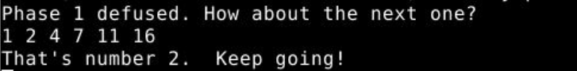


## phase_3

phase_3：

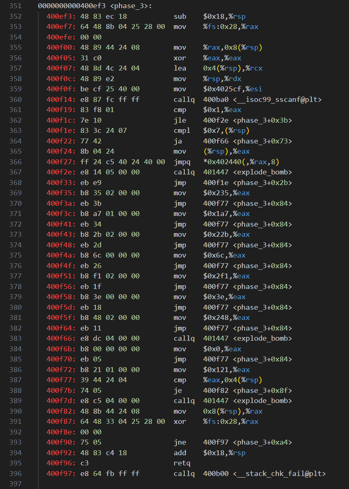

可以看到 phase_3 一开始调用了 sscanf 函数处理我们的 input，直接老样子，先看一下第二个参数，也就是输入的格式是什么：

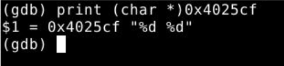

看来我们需要输入两个整数，它们存储在栈上面。

phase_3 的核心代码中，很明显用到了跳转表，是一个 switch 语句：

```assembly
# explode if the first input number is greater than 7 or less than 0
400f1e:	83 3c 24 07          	cmpl   $0x7,(%rsp) 
400f22:	77 42                	ja     400f66 <phase_3+0x73>

400f24:	8b 04 24             	mov    (%rsp),%eax
400f27:	ff 24 c5 40 24 40 00 	jmpq   *0x402440(,%rax,8)
```

从中可得：

1. 如果第一个参数大于 7 或者小于 0，则爆炸。得知 case 的范围是 0~7，一共 8 个数。
2. switch 的数据类型为 long，`switch(第一个参数)`。

看一眼跳转表 0x402440，使用命令 `x/xb64 0x402440`，意为查看从 0x402440 开始的 64 个字节，因为一个地址占 8 个字节，case 一共 8 个，所以长度为 64 个字节：

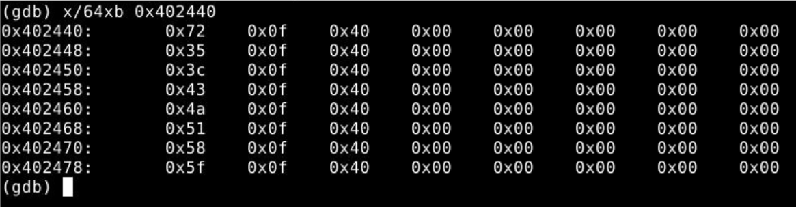

一共 8 行，每一行正好代表一个地址，从上到下依次是 first_input = 0 1 2 … 7 的时候，跳转到的地址。但是读的时候一定要注意存储的方式是小端法，因此地址的低字节存储在低地址，拿第一行为例，0x72 应该是地址的最低字节，因此读的时候“从右向左”读，得到 case 0 时，跳转到 `0x400f72`。

同理可以得到所有 case 跳转的地址，我把它们标记到下图中：

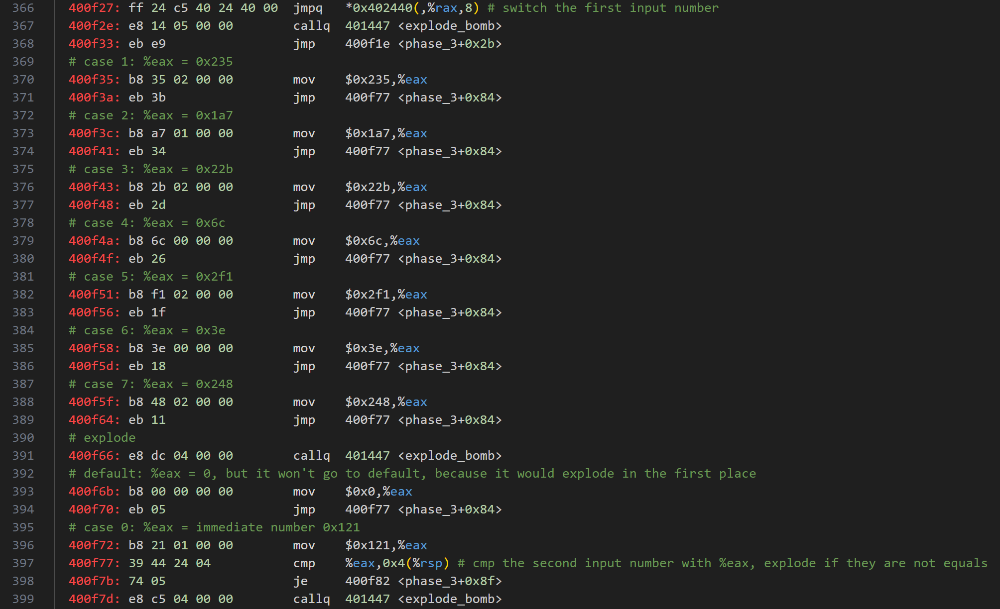

最后所有 case 都会 `cmp   %eax,0x4(%rsp)`，即判断第二个输入和经过赋值后 %eax 是否相等。

于是可以得到我们输入要求：

1. 两个整数
2. 第一个整数为 0~7；
3. 第二个整数为：相应 case 中给 %eax 赋值的立即数。

因此 phase_3 有 8 个合理的输入：

1. `0 289`
2. `1 565`
3. `2 423`
4. `3 555`
5. `4 108`
6. `5 753`
7. `6 62`
8. `7 584`

随便选一个，成功通过：

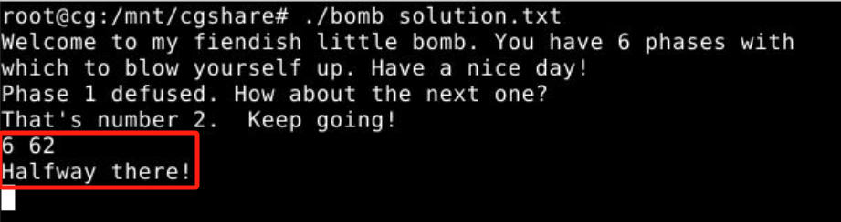


## phase_4

phase_4：

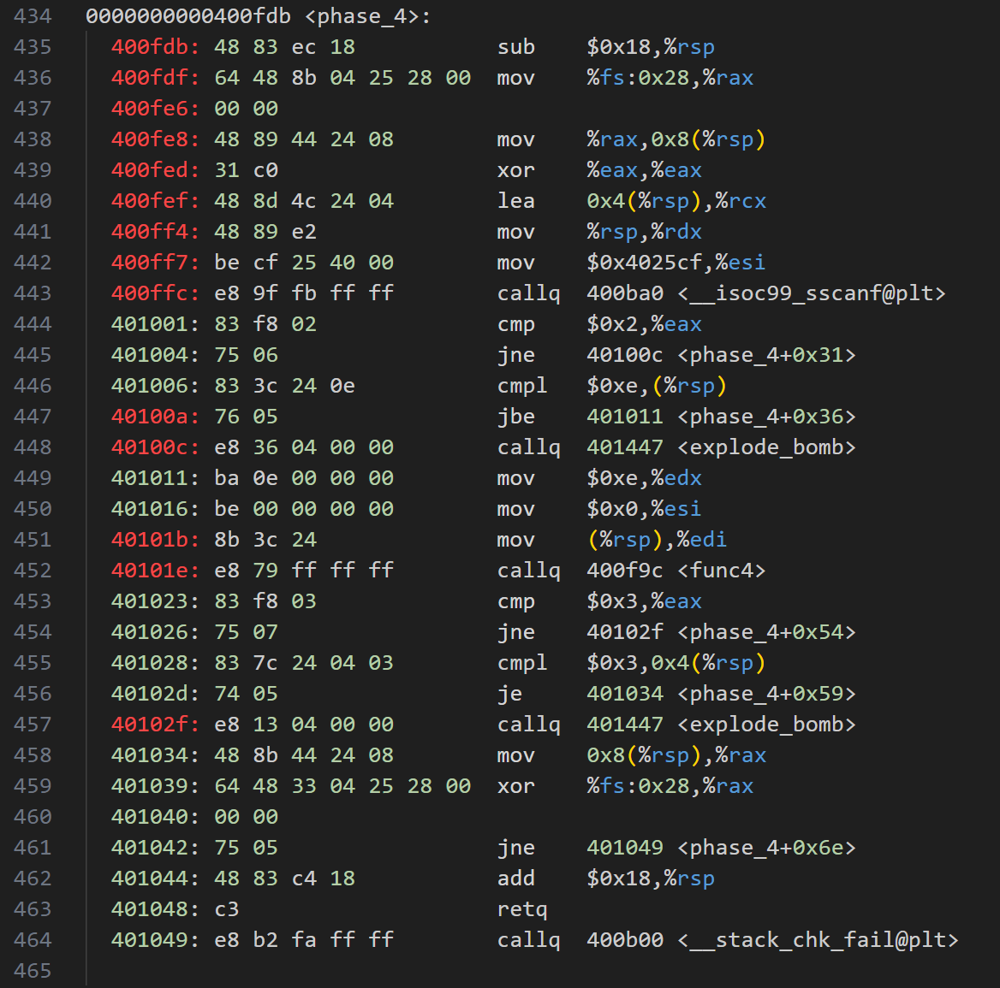

老规矩，看一下 sscanf 的 format：

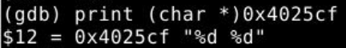

输入是两个整数。

先简单分析一下，结果如下：

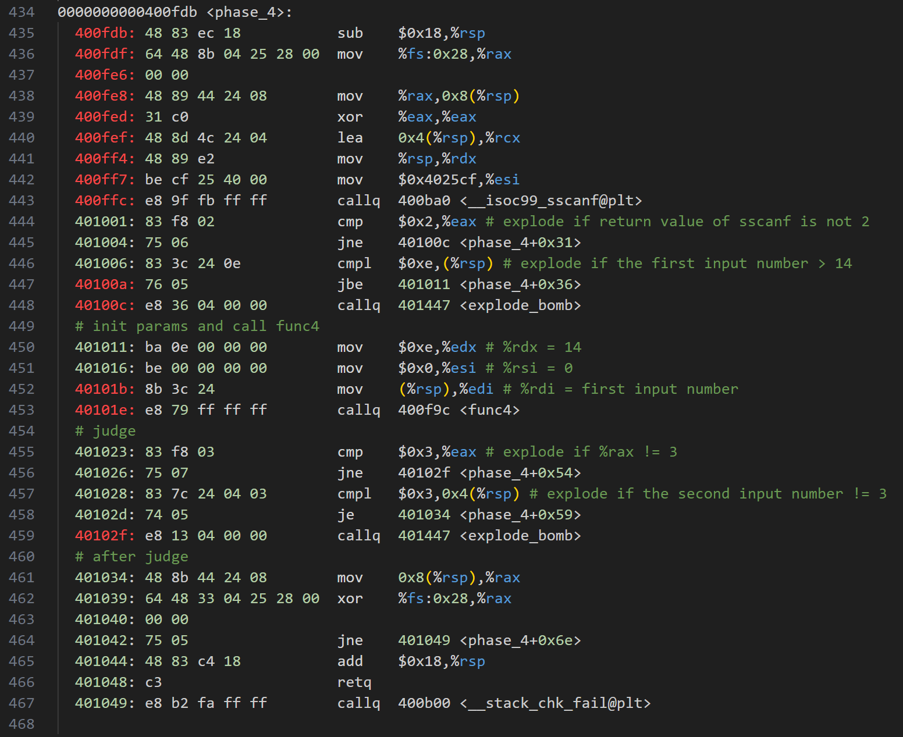

显然第二个整数必须是 3，我们重点分析 func4：

传入的参数：`%rdi = first input number`，`%rsi = 0`，`%rdx = 14`，以及我们存储在 %rsp 中的两个输入整数。

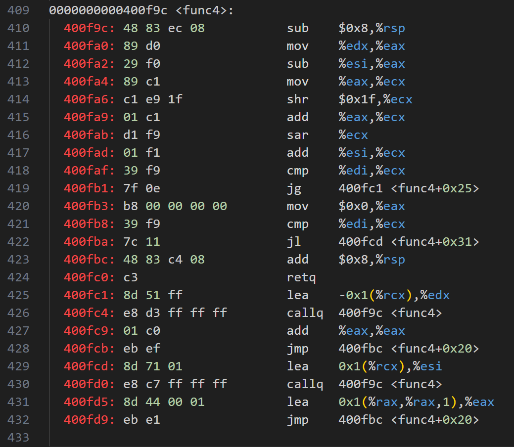

分析后如图：

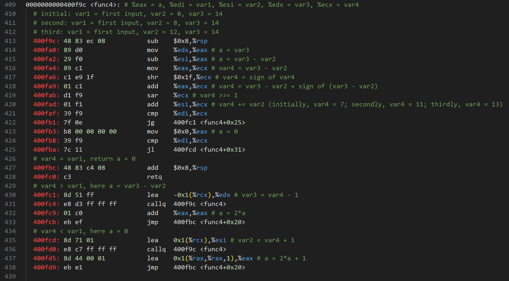

我们知道最后 a 必须是 3 才能成功。

第一次递归的返回值 a 必须等于 3 ，只有 a = a \* 2 + 1 才能得到 3，因此第一次必须满足 `var4 < var1`，即输入必须 > 7。

第二次递归的返回值 a 必须为 1，因此第二次递归中也必须满足 `var4 < var1`，即输入 > 11。

第三次递归的返回值 a 需要为 0，这里有两种可能：

1.  `var4 = var1` 直接 return a = 0，var1 = 13，我们的第一个输入是 13。因此第一个答案是 `13 3`

	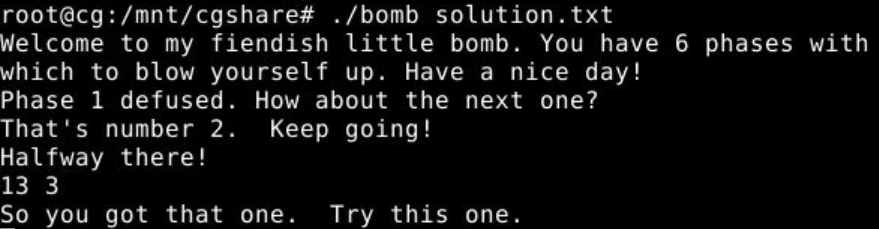

2. `var4 > var1`，输入满足 `11 < input < 13`，只能是 12。但是仍然要检验这种可能是否合理！第四次递归的返回值是 0，运算结束后的 var4 = 12，刚好和 input 相等，然后返回 a = 0，与我们的推理一致，因此第二个答案是 `12 3`

	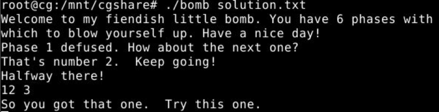


## phase_5

phase_5：

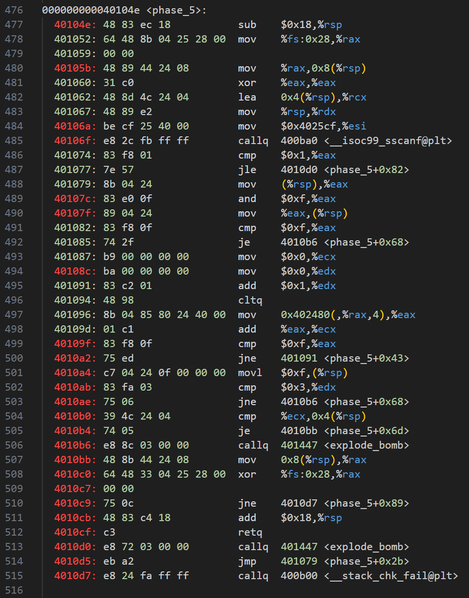

0x4025cf 是不是有点印象，这跟 phase_4 里面的 format 字符串放在同一个地址。由此还能得知：c 语言将所有的字符串放到一片内存里面，相同的字符串只会分配一个地址，这样可以节省内存开销。

简单分析后如下图：

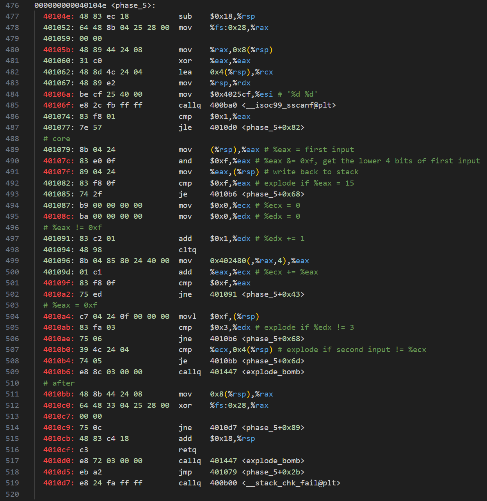

最核心的部分就是 `mov   0x402480(,%rax,4),%eax` 后 %eax 的值。我们先用 gdb 来看一下 0x402480 开头的这个 int 数组，由于上面 %eax &= 0xf，因此数组的索引范围是 0~15，一个 int 4 字节，4 \* 16 = 64 个字节：

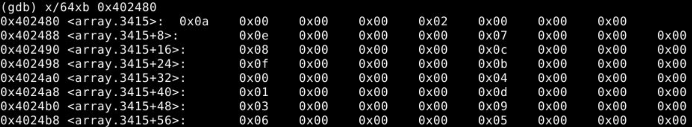

根据小端法取出这 15 个整数：`[10, 2, 14, 7, 8, 12, 15, 11, 0, 4, 1, 13, 3, 9, 6, 5]`，发现它们刚好是不重复的 0~15。

走到 `%eax = 0xf` 代码段中时，要求 `%edx == 3`，而 %edx 最初等于 0，因此需要执行 3 次 `%eax != 0xf` 的代码之后，`%eax = 0xf`。

这下就简单了，只需要倒推。第三次之后 %eax = 15，那么第二次之后 %eax = 6，第一次之后 %eax = 14，最开始 %eax = 2，所以第一个输入 & 15 = 2，比如 0x7ffffff2 = 2147483634

%ecx 等于 0 + 14 + 6 + 15 = 35，所以第二个输入为 35。

轻松通过验证：

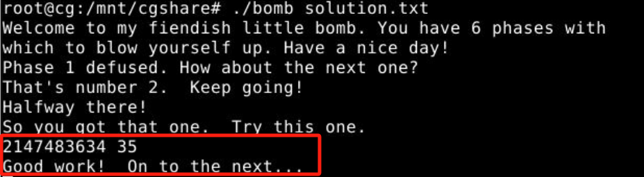


